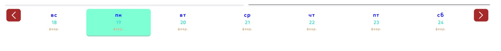

# Тестовое задание

Необходимо разработать SPA-сайт на основе Vue3, который содержит в себе список объявлений (карточка объявления на свое усмотрение, но должна быть дата у каждого объявления), которые выводятся по нужной дате, выбранной в календаре

Необходимая реализация:

1. Должен быть реализован горизонтальный календарь на 4-6 дней подобного рода:
   
2. Кнопки по бокам должны должны пролистывать полоску календаря на предыдущие/следующие дни
3. При наведении на день, элемент должен подсвечиваться
4. Выбранный день должен выделяться на полоске календаря
5. При нажатии на определенный день должен выводиться список  объявлений на выбранную дату
6. Общий список объявлений (со всеми датами) должен лежать в сторе пользователя
